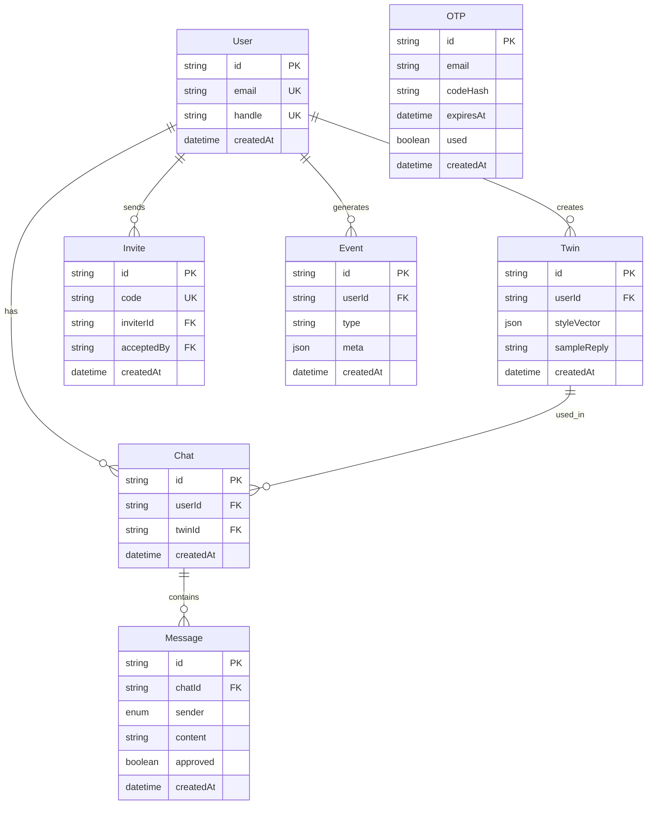
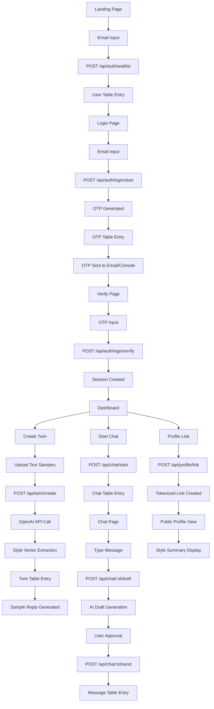
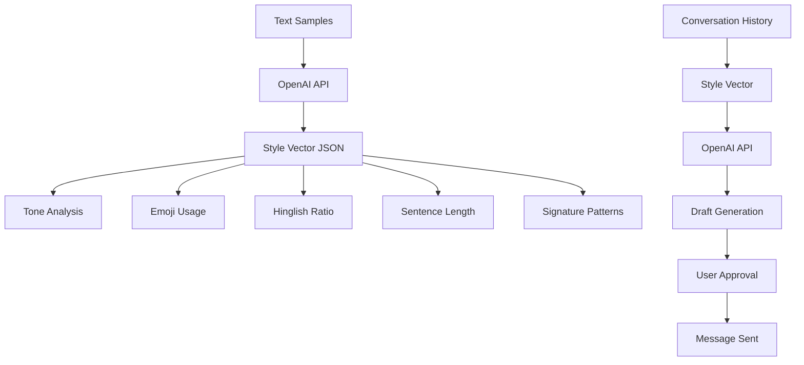

# AI Twin System Flow - Mermaid Diagram

## Database Schema

```mermaid
erDiagram
    User {
        string id PK
        string email UK
        string handle UK
        datetime createdAt
    }
    
    Twin {
        string id PK
        string userId FK
        json styleVector
        string sampleReply
        datetime createdAt
    }
    
    Chat {
        string id PK
        string userId FK
        string twinId FK
        datetime createdAt
    }
    
    Message {
        string id PK
        string chatId FK
        enum sender
        string content
        boolean approved
        datetime createdAt
    }
    
    OTP {
        string id PK
        string email
        string codeHash
        datetime expiresAt
        boolean used
        datetime createdAt
    }
    
    Invite {
        string id PK
        string code UK
        string inviterId FK
        string acceptedBy FK
        datetime createdAt
    }
    
    Event {
        string id PK
        string userId FK
        string type
        json meta
        datetime createdAt
    }
    
    User ||--o{ Twin : creates
    User ||--o{ Chat : has
    User ||--o{ Invite : sends
    User ||--o{ Event : generates
    Twin ||--o{ Chat : used_in
    Chat ||--o{ Message : contains
```

## Application Flow

```mermaid
flowchart TD
    A[Landing Page] --> B[Email Input]
    B --> C[POST /api/auth/waitlist]
    C --> D[User Table Entry]
    D --> E[Login Page]
    E --> F[Email Input]
    F --> G[POST /api/auth/login/start]
    G --> H[OTP Generated]
    H --> I[OTP Table Entry]
    I --> J[OTP Sent to Email/Console]
    J --> K[Verify Page]
    K --> L[OTP Input]
    L --> M[POST /api/auth/login/verify]
    M --> N[Session Created]
    N --> O[Dashboard]
    
    O --> P[Create Twin]
    P --> Q[Upload Text Samples]
    Q --> R[POST /api/twin/create]
    R --> S[OpenAI API Call]
    S --> T[Style Vector Extraction]
    T --> U[Twin Table Entry]
    U --> V[Sample Reply Generated]
    
    O --> W[Start Chat]
    W --> X[POST /api/chat/start]
    X --> Y[Chat Table Entry]
    Y --> Z[Chat Page]
    Z --> AA[Type Message]
    AA --> BB[POST /api/chat/:id/draft]
    BB --> CC[AI Draft Generation]
    CC --> DD[User Approval]
    DD --> EE[POST /api/chat/:id/send]
    EE --> FF[Message Table Entry]
    
    O --> GG[Profile Link]
    GG --> HH[POST /api/profile/link]
    HH --> II[Tokenized Link Created]
    II --> JJ[Public Profile View]
    JJ --> KK[Style Summary Display]
```

## Security Flow

```mermaid
flowchart LR
    A[Request] --> B[Rate Limiting]
    B --> C[CSRF Check]
    C --> D[Authentication]
    D --> E[Input Validation]
    E --> F[Content Sanitization]
    F --> G[Blacklist Check]
    G --> H[Toxicity Check]
    H --> I[Controller]
    I --> J[Service]
    J --> K[Database]
    K --> L[Response]
```

## AI Processing Flow

```mermaid
flowchart TD
    A[Text Samples] --> B[OpenAI API]
    B --> C[Style Vector JSON]
    C --> D[Tone Analysis]
    C --> E[Emoji Usage]
    C --> F[Hinglish Ratio]
    C --> G[Sentence Length]
    C --> H[Signature Patterns]
    
    I[Conversation History] --> J[Style Vector]
    J --> K[OpenAI API]
    K --> L[Draft Generation]
    L --> M[User Approval]
    M --> N[Message Sent]
```
